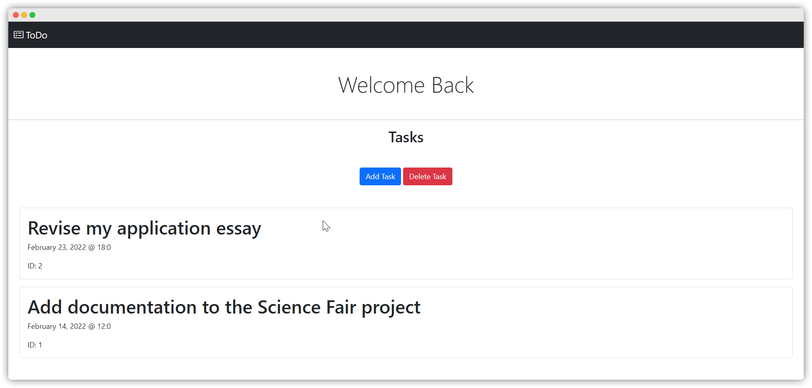

# ToDo

[](https://github.com/MrFellox/todo-web)


Una página web simple que te ayuda a monitorear tus deberes.<br>
Creado para la Feria de Ciencias y Tecnología de Escuelas Episcopales 2022.



To read these instructions in English, follow [this link.](https://github.com/mrfellox/todo-web).

## Características
<li>Diseño responsivo</li>
<li>Opera en tu red local. Así puedes acceder a la página desde cualquier dispositivo que está conectado a la misma red.</li>
<li>Simple, miniaturizado, y minimalista</li>


## Empezando

#### Dependencias

Antes de empezar, asegúrate de tener [Python](https://python.org/download) 3.9 o superior, y revisa que esté agregado al PATH. También necesitarás [SQLite3](https://www.sqlite.org/index.html)

#### Setup and installation

1. [Descarga](https://github.com/MrFellox/todo-web/archive/refs/heads/main.zip) el código fuente de GitHub, o clona este repositorio con Git.

```shell
git clone https://github.com/MrFellox/todo-web.git
```

3. **(Recomendado)** Crea un ambiente virtual y actívalo.

```shell
# Ejemplo para Windows

# Crea un nuevo ambiente virtual
python3 -m venv venv

# Activa el ambiente virtual (necesitarás activarlo cada vez que quieras usar este proyecto)
venv\Scripts\activate
```

2. Instala las dependencias con pip.

```shell
pip install -r requirements.txt
```

3. Crea la base de datos.
```shell
# Este comando solo aplica para Windows, si estás en otro sistema operativo, solo sigue los comandos que estan en todo/create_db.sql

db_setup.bat
```

4. Inicia el servidor de desarrollo de Flask.
```shell
python3 start.py
```

Ahora puedes acceder a la URL que se encuentra en la consola.